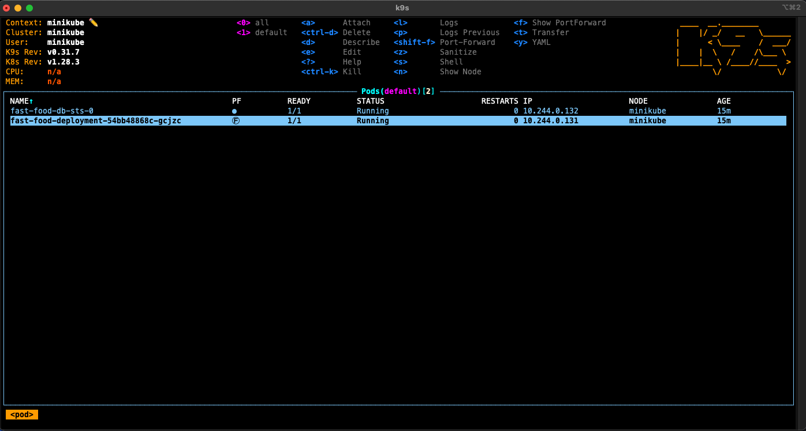

## Descrição
Gerenciamento de clusters com o k9s


## Instalação 

Site oficial -> https://k9scli.io/

## Rodar k9s em um namespace

 ```bash
# Clone este repositório
$ git clone <https://github.com/tshadz/soat3-tech-chalenge>

# Acesse a pasta do projeto no terminal
$ cd ./soat3-tech-chalenge

# Iniciar o minikube
$ minikube start

# Deploy da aplicação
$ kubectl apply -f k8s/

# Rodar K9s em um namespace
$ k9s -n <namespace>

```

## k9s tela

